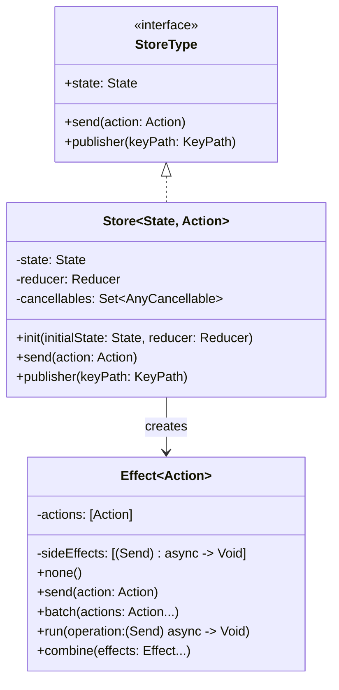
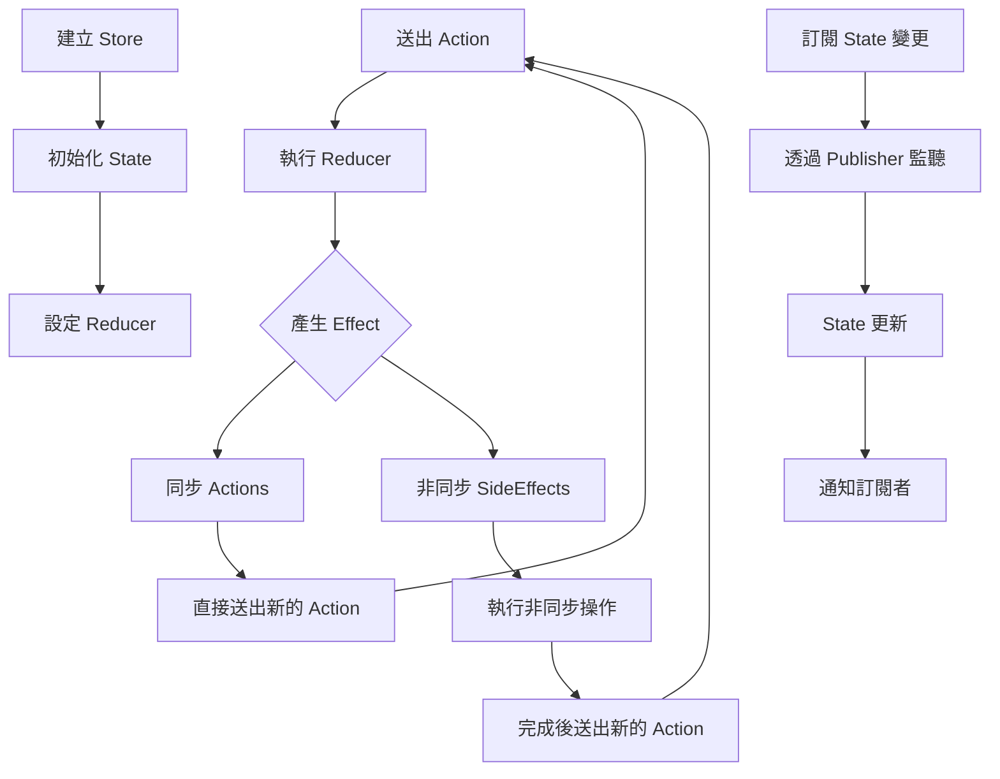

# SwiftFlux 架構說明

## 類別關係圖

## 動作流程圖

## 處理流程說明

1. **初始化階段**
   - 建立 Store 時需提供初始 State 和 Reducer
   - Reducer 是一個將目前 State 和 Action 轉換為新 State 的函式

2. **Action 處理流程**
   - 當 `send()` 被呼叫時，會觸發 Reducer
   - Reducer 會回傳 Effect 物件
   - Effect 可以包含：
     - 同步的 Actions：立即被處理
     - 非同步的 SideEffects：在背景執行

3. **State 訂閱機制**
   - 使用 Combine framework 的 Publisher 機制
   - 可以訂閱整個 State 或特定屬性的變更
   - 當 State 更新時，所有訂閱者都會收到通知 